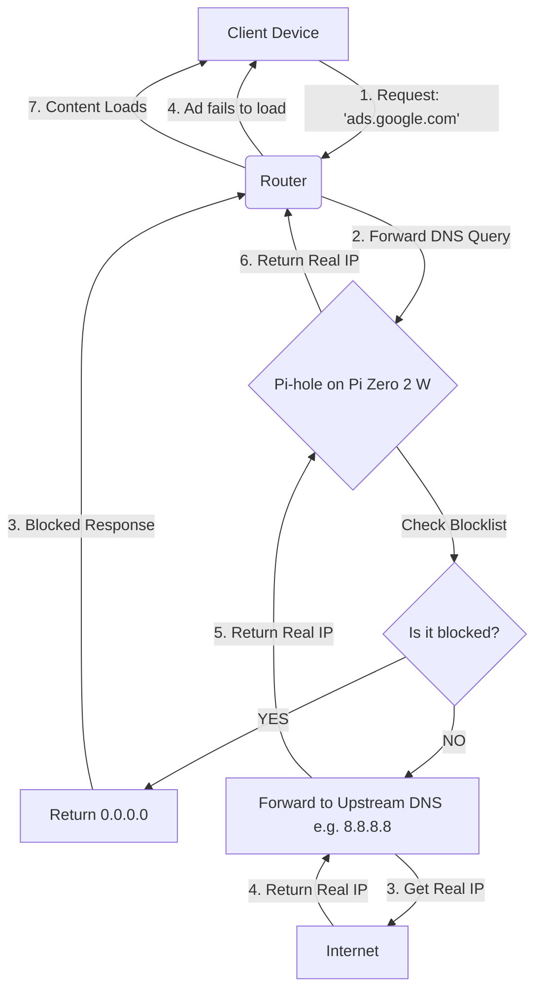

# 🛡️ Network-Wide Adblocker (Pi-hole)

### **Role:** Network Administration (Self-Hosted)

## 🚀 Overview
Standard ISP routers lack granular traffic control and expose networks to telemetry and intrusive advertising. This project implements a **network-wide DNS sinkhole** to reduce bandwidth usage, block telemetry, and enforce network-level security policies without requiring client-side software.

## 🛠️ Tech Stack

| Component | Technology |
| :--- | :--- |
| **Hardware** |  |
| **OS** | -FCC624?style=flat-square&logo=linux&logoColor=black) |
| **Service** |  |
| **Storage** | 64GB MicroSD |
| **Protocols** | `DNS` • `DHCP` • `SSH` • `IPv4/IPv6` |

## ⚙️ How It Works
The Pi-hole acts as a gatekeeper for DNS requests. Instead of devices connecting directly to the open internet for ads, the traffic follows this logic:

1.  **Request:** Client device asks for `ads.google.com`.
2.  **Forward:** Router sends the query to the Raspberry Pi.
3.  **Sinkhole:** Pi-hole compares the request against a massive "Gravity" database.
4.  **Result:** * **Blocked:** The Pi returns `0.0.0.0` (the ad never loads).
    * **Allowed:** The Pi returns the real IP and the content loads.

## ✨ Key Features & Benefits
* **Privacy by Default:** Blocks tracking and telemetry at the source.
* **Network Performance:** Saves bandwidth by preventing ad-heavy assets from downloading.
* **Device Agnostic:** Protects everything from Smart TVs and IoT devices to mobile phones without installing individual apps.

## 📋 Implementation Steps (The "How")
* **Headless Initialization:** Flashed Raspberry Pi OS Lite to SD card. Created `wpa_supplicant.conf` (WLAN credentials) and an empty `ssh` file in the boot partition to enable immediate headless SSH access upon first boot.
* **Static IP Assignment:** Edited `/etc/dhcpcd.conf` to assign a static private IP (e.g., `192.168.0.200`) to the interface, ensuring persistent DNS reachability for the network.
* **Router Configuration:** Accessed ISP router gateway. Replaced default ISP DNS entries with the Pi-hole static IP.
* **Blocklist Hardening:** Integrated regex filters to target specific Smart TV telemetry domains and added the `oisd` big blocklist for enhanced coverage beyond default lists.

## 🧠 Key Competencies Demonstrated
* **Linux System Administration:** Headless server management, SSH key management, package updates (`apt`), and service monitoring (`systemctl`).
* **Network Protocols:** Deep understanding of DNS hierarchy (A/AAAA records), DHCP lease handling, and TCP/IPv4/IPv6 stacks.
* **Network Security:** Traffic analysis, sinkholing strategies, and attack surface reduction via telemetry blocking.
* **Infrastructure Management:** Single-board computer (SoC) configuration, power management, and thermal monitoring.

## ⚠️ Challenges & Troubleshooting (Critical)
**Issue:** ISP-provided router firmware locked the DNS settings, preventing the assignment of a custom local DNS server.

**Resolution:**
1.  Disabled the DHCP server on the ISP router entirely.
2.  Enabled the DHCP server within the Pi-hole interface.
3.  Configured Pi-hole to distribute IP addresses and force itself as the primary DNS gateway for all connected clients.

**Result:** Successfully routed 100% of network traffic through the sinkhole despite hardware limitations.