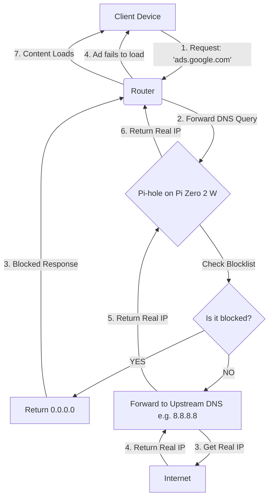

# network-wide-adblocker-pi-zero

## Role: Network Administration (Self Hosted)
## Tech Stack: Raspberry Pi Zero 2W, microSD card 64Gb, Linux (Raspberry Pi OS Lite), Pi-hole, DNS, DHCP, SSH

- Standard ISP routers lack granular traffic control and expose networks to telemetry/ads. Implemented a network-wide DNS sinkhole to reduce bandwidth usage, block telemetry, and enforce network-level security policies without client-side software

